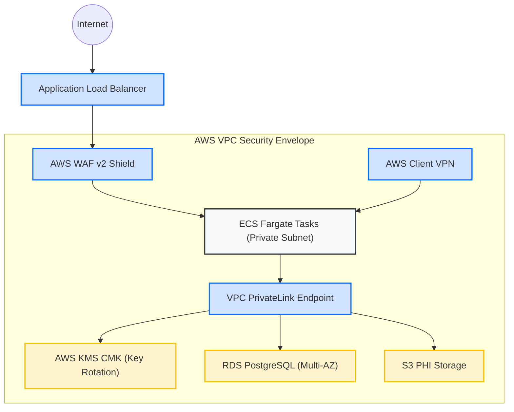

# HIPAA Stack (AWS)

**An production-ready, compliance-first infrastructure library for secure digital health systems.**

`hipaa-stack` provides modular, security-hardened Infrastructure as Code (IaC) blueprints engineered specifically to satisfy HIPAA / HITECH Technical Safeguards on Amazon Web Services (AWS). It is designed for founders and engineering teams building in the clinical, digital health, and medical AI space.

---

## Architectural Blueprint

The modules in this library cooperate to create a secure, multi-layered environment for clinical workloads:



---

## Hardened AWS Service Blueprints

| Modular Service | Compliance Coverage | Configured Security Features |
| :--- | :--- | :--- |
| 🛡️ **[services/vpc](./services/vpc)** | Network Isolation | Private subnets, VPC Flow Logs, and Interface Endpoints |
| 🔑 **[services/kms](./services/kms)** | Cryptographic Control | Customer Managed Key (CMK) with enforced annual rotation |
| 🗄️ **[services/s3](./services/s3)** | Immutable Storage | SSE-KMS, Versioning, TLS-only policy, access logging |
| 🗃️ **[services/rds](./services/rds)** | Secure Database | Encrypted Multi-AZ PostgreSQL, IAM Authentication |
| 🩺 **[services/healthlake](./services/healthlake)** | Standardized Exchange | Native FHIR R4 clinical datastore with KMS encryption |
| 🚀 **[services/fargate](./services/fargate)** | Isolated Compute | ECS Fargate Cluster, private subnets, CloudWatch logging |
| 🛡️ **[services/vpn](./services/vpn)** | Secure Ingress | Client VPN endpoint, TLS certificates, logging |
| 🎛️ **[services/waf](./services/waf)** | Exploit Defense | AWS WAFv2 ACL with SQLi and XSS protection rules |
| 📜 **[services/cloudtrail](./services/cloudtrail)** | Complete Auditing | Management and S3 data-plane event logging, validation |
| 📈 **[services/cloudwatch](./services/cloudwatch)** | Encryption Logs | KMS-encrypted Log Groups, 365-day retention policy |
| 🔏 **[services/secretsmanager](./services/secretsmanager)** | Secret Isolation | KMS-encrypted credentials, automated rotation |
| 🚨 **[services/guardduty](./services/guardduty)** | Threat Intelligence | Continuous intelligent scanning and alert processing |
| 💾 **[services/backup](./services/backup)** | Disaster Recovery | Centralized backup plans, S3/RDS backup vault |

---

## Usage Example

```hcl
# 1. Spin up the cryptographic CMK
module "compliance_kms" {
  source      = "github.com/drjseifu3003/hipaa-stack//services/kms"
  name_prefix = "care-prod"
  environment = "production"
  description = "Primary key for clinic data encryption"
  key_alias   = "phi-encryption-key"
}

# 2. Build the secure network boundaries
module "compliance_vpc" {
  source      = "github.com/drjseifu3003/hipaa-stack//services/vpc"
  name_prefix = "care-prod"
  environment = "production"
}

# 3. Provision encrypted object storage for patient reports
module "compliance_storage" {
  source      = "github.com/drjseifu3003/hipaa-stack//services/s3"
  bucket_name = "clinical-patient-records-prod"
  environment = "production"
  kms_key_arn = module.compliance_kms.kms_key_arn
}
```

---

## Developer Integration & Guidelines

To automate these compliance checks during development, integrate our developer skill configuration:

* **[docs/compliance-mapping.md](./docs/compliance-mapping.md)** — Explains the direct mapping of HIPAA citations to each Terraform module.
* **[skill/SKILL.md](./skill/SKILL.md)** — Configures Cursor or Claude Desktop to automatically validate AWS configurations against HIPAA rules.

---

## License

This repository is licensed under the MIT License. See [LICENSE](LICENSE) for details.
