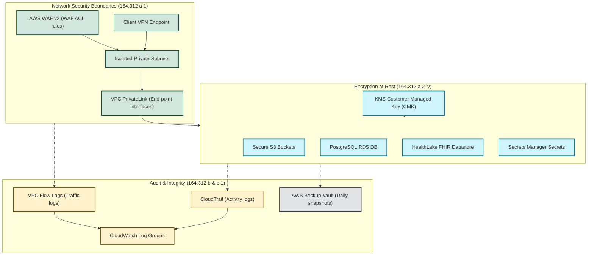

# AWS HIPAA Compliance Mapping

This document details how the AWS resources provisioned by the **HIPAA Stack** modules map directly to the **HIPAA Security Rule Technical Safeguards (45 CFR § 164.312)**. 

---

## Architectural Mapping Overview

The diagram below visualizes how the different modules of the HIPAA Stack isolate workloads, protect data at rest and in transit, and maintain auditing pipelines.

---

## Safeguards Matrix & Implementations

### 1. Access Control
> **HIPAA Citation:** § 164.312(a)(1)
> 
> *Requirement:* Establish policies and procedures for granting access to systems containing Electronic Protected Health Information (ePHI) only to authorized users and processes.

* **Stack Implementation:**
  * **[services/vpc](file:///c:/Users/derej/projects/hipaa-stack/services/vpc)**: Places database and compute workloads inside isolated private subnets. All ingress paths from public internet zones are blocked.
  * **[services/vpn](file:///c:/Users/derej/projects/hipaa-stack/services/vpn)**: Restricts workspace environment ingress to authenticated clients utilizing certificate-based VPN tunnels.
  * **[services/waf](file:///c:/Users/derej/projects/hipaa-stack/services/waf)**: Uses AWS WAFv2 rules (SQL injection prevention, common exploit protection) to protect client endpoints from malicious injection or scraping.
  * **[services/fargate](file:///c:/Users/derej/projects/hipaa-stack/services/fargate)**: Implements task execution IAM roles restricting containers to least-privilege AWS API access.

### 2. Encryption and Decryption
> **HIPAA Citation:** § 164.312(a)(2)(iv)
> 
> *Requirement:* Enforce mechanisms to encrypt and decrypt Electronic Protected Health Information (ePHI) where applicable.

* **Stack Implementation:**
  * **[services/kms](file:///c:/Users/derej/projects/hipaa-stack/services/kms)**: Establishes a Customer Managed Key (CMK) policy with automatic annual key rotation. This CMK acts as the root encryptor for all other modules.
  * **[services/s3](file:///c:/Users/derej/projects/hipaa-stack/services/s3)**: Enforces Server-Side Encryption with AWS KMS keys (SSE-KMS) on all buckets.
  * **[services/rds](file:///c:/Users/derej/projects/hipaa-stack/services/rds)**: Automatically configures instance storage and Performance Insights to be encrypted using the KMS key.
  * **[services/healthlake](file:///c:/Users/derej/projects/hipaa-stack/services/healthlake)**: Provisions a native FHIR datastore encrypted at the database level.

### 3. Audit Controls
> **HIPAA Citation:** § 164.312(b)
> 
> *Requirement:* Implement hardware, software, or procedural mechanisms that record and examine activity in systems containing or using ePHI.

* **Stack Implementation:**
  * **[services/cloudtrail](file:///c:/Users/derej/projects/hipaa-stack/services/cloudtrail)**: Enforces logging of both management (API configuration changes) and S3 data-plane events (reads/writes/deletes).
  * **[services/cloudwatch](file:///c:/Users/derej/projects/hipaa-stack/services/cloudwatch)**: Establishes centralized Log Groups encrypted with the KMS CMK. Retains logs for 365 days to meet clinical audit requirements.
  * **[services/guardduty](file:///c:/Users/derej/projects/hipaa-stack/services/guardduty)**: Evaluates threat patterns (e.g., brute-force access, credential leakage) across VPC Flow Logs and API activity.

### 4. Data Integrity
> **HIPAA Citation:** § 164.312(c)(1)
> 
> *Requirement:* Implement policies and procedures to protect ePHI from improper alteration or destruction.

* **Stack Implementation:**
  * **[services/s3](file:///c:/Users/derej/projects/hipaa-stack/services/s3)**: Enables S3 Object Versioning to store complete histories of all document states, protecting against accidental overrides.
  * **[services/backup](file:///c:/Users/derej/projects/hipaa-stack/services/backup)**: Automates snapshots of RDS and S3 resources, saving them in a secure vault with custom retention locks.

### 5. Transmission Security
> **HIPAA Citation:** § 164.312(e)(1)
> 
> *Requirement:* Implement security measures to guard against unauthorized access to ePHI while in transit.

* **Stack Implementation:**
  * **[services/s3](file:///c:/Users/derej/projects/hipaa-stack/services/s3)**: Attaches a bucket policy that denies all HTTP requests lacking secure SSL transport headers (`aws:SecureTransport = "false"`).
  * **[services/vpc](file:///c:/Users/derej/projects/hipaa-stack/services/vpc)**: Deploys Interface Endpoints (AWS PrivateLink) inside the private subnets. All system calls to S3, KMS, Bedrock, or Secrets Manager route within the private AWS network backbone, never crossing public internet paths.
