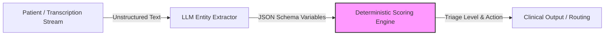

# Deterministic Triage Scoring Pattern

When designing clinical AI assistants (such as patient triage bots, symptom collectors, or scheduling assistants), developers must ensure that the AI does not make autonomous clinical judgment calls. 

This pattern details how to isolate LLMs from clinical triage logic, ensuring safety, auditability, and compliance under healthcare regulations.

---

## 1. The Core Problem

Allowing an LLM to directly determine a patient's severity level (e.g., "Output 'Urgent' or 'Non-Urgent'") introduces severe risks:
- **Hallucinations**: The LLM may classify a critical symptom (e.g., left arm pain) as non-urgent based on subtle prompt variations.
- **Lack of Traceability**: Deep learning models are black boxes; you cannot inspect *why* the model chose "Urgent" on a specific run.
- **Regulatory Risk**: Software that makes clinical decisions autonomously is often classified as a Medical Device (SaMD - Software as a Medical Device) and requires rigorous FDA or regulatory approval.

---

## 2. Decoupled Architecture

The solution is to split the triage pipeline into two distinct phases:



### Phase 1: Structured Entity Extraction (LLM)
The LLM is used strictly as a parser. It reads the unstructured patient input or transcript and extracts clinical variables into a structured JSON payload matching a predefined schema.
- **Prompting**: Instruct the LLM to locate and extract symptoms, pain levels, duration, and key flags (e.g., chest pain, breathing difficulty).
- **Tool Calling / JSON Schema**: Force JSON output conforming to a schema.
- **Example Extraction Output**:
  ```json
  {
    "symptom_reported": "chest pain",
    "duration_hours": 3,
    "pain_intensity_1_to_10": 8,
    "has_shortness_of_breath": true,
    "is_diabetic": false
  }
  ```

### Phase 2: Deterministic Scoring (Application Logic)
The structured JSON is passed to standard, compiled code (Python, Go, TypeScript) that executes a deterministic decision table or clinical protocol (e.g., Emergency Severity Index (ESI) rules).
- **Example Protocol Code**:
  ```typescript
  function calculateTriageScore(data: ExtractionSchema): TriageAction {
    if (data.symptom_reported === "chest_pain" && data.pain_intensity_1_to_10 >= 7) {
      return { level: 1, action: "ROUTE_TO_EMERGENCY" };
    }
    if (data.has_shortness_of_breath) {
      return { level: 2, action: "IMMEDIATE_NURSE_CALLBACK" };
    }
    return { level: 5, action: "SCHEDULE_STANDARD_APPOINTMENT" };
  }
  ```

---

## 3. Benefits

1. **Auditability**:
   - Both the extracted JSON and the final triage action are logged. If a decision is disputed, engineers and clinicians can inspect the JSON values and the mathematical rules that ran.
2. **Safety Guarantees**:
   - The LLM *cannot* override safety thresholds. If the LLM extracts `has_shortness_of_breath = true`, the code is guaranteed to route to a nurse callback, regardless of what the LLM's conversational text says.
3. **Regulatory Compliance**:
   - The application logic operates as a standard decision support tool (where rules are defined and verifiable), making regulatory validation much simpler.
