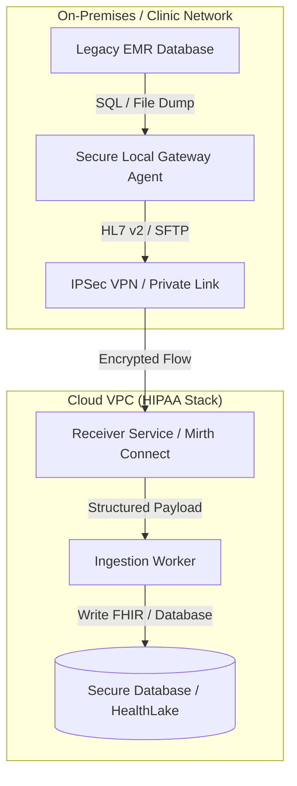

# Integrating EMRs Without Public APIs

Electronic Medical Record (EMR) systems in clinical environments often lack modern, public-facing REST APIs or FHIR endpoints. Yet, healthcare SaaS and AI applications must ingest clinical events, schedules, or patient notes.

This pattern documents battle-tested, HIPAA-compliant strategies to integrate with legacy EMRs securely.

---

## 1. Architectural Patterns

### Pattern A: Secure Local Gateway Agent (VPC Peering/VPN)
Many EMRs allow local database queries or produce scheduled backups on a local filesystem.
- **Implementation**: Deploy a lightweight, containerized agent (e.g. running on a local virtual machine inside the hospital network).
- **Security**: The agent initiates an outbound connection to the cloud VPC via an **IPSec Site-to-Site VPN** or **AWS/Azure PrivateLink**. The local agent queries the EMR database locally (read-only) and pushes data to the VPC.
- **Advantage**: No ports are opened inbound to the hospital network.

### Pattern B: HL7 v2 Message Streams
Legacy EMRs communicate internally using HL7 v2 (e.g., ADT - Admission, Discharge, Transfer events; ORU - Observational Result User).
- **Implementation**: Set up an HL7 listener (like Mirth Connect / NextGen Connect) inside the private subnet of the Cloud VPC.
- **Security**: The EMR transmits HL7 streams over a TCP connection wrapped in TLS (MLLPS - Minimal Lower Layer Protocol over TLS) across the Site-to-Site VPN.

### Pattern C: Secure SFTP File Exchange
The EMR exports scheduled batches of CCDA (Continuity of Care Document) XML files, PDF reports, or CSV exports to a local directory.
- **Implementation**: The Local Gateway Agent watches the folder, encrypts the files using PGP/GPG, and pushes them to a secure cloud SFTP server (e.g., AWS Transfer Family or Azure SFTP-enabled Blob Storage).
- **Security**: The cloud bucket is locked down with SSE-KMS, and lifecycle policies automatically decrypt, parse, write to database, and purge the raw SFTP directory.

---

## 2. Security & Compliance Checklist

1. **BAA (Business Associate Agreement)**:
   - Ensure the VPN gateway provider and any translation middleware vendor (if hosted) have signed BAAs.
2. **At-Rest Encryption**:
   - Local Gateway Agent directories storing transient XML/CSV dumps must use encrypted disks (e.g., BitLocker, dm-crypt).
3. **Data Minimization**:
   - The query or export script must only retrieve fields absolutely necessary for the application. Do not do `SELECT *` on patient tables.
4. **Log Retention**:
   - Gateway agents must log execution timestamps, error codes, and audit logs. Gateway logs must *never* print actual PHI payloads (e.g. patient name, SSN) to the standard output or disk files.
