# Secure Voice AI PHI Handling Pattern

Voice-based clinical AI systems (e.g. conversational triage agents, automated transcriptionists, or check-in bots) process audio data in real time. Since voice streams contain highly sensitive diagnostic data and patient identifiers, they demand strict adherence to HIPAA guidelines.

This pattern covers the ingestion, real-time streaming, and storage configurations required for voice-based AI integrations (such as Twilio and Vapi).

---

## 1. Real-Time Voice Streaming Architecture

```mermaid
graph LR
    Patient[Patient Phone / SIP] -->|Voice Call| Twilio[Twilio Voice Gateway]
    Twilio -->|WebSockets WSS| Server[Voice Stream Proxy Server]
    Server -->|TLS Realtime Stream| SpeechAPI[Speech-to-Text Engine]
    SpeechAPI -->|Transcription Chunks| Redactor[Inline PHI Redactor]
    Redactor -->|Scrubbed Text| LLM[LLM Triage Engine]
```

### In-Transit Security (TLS)
- **Secure WebSockets**: Real-time media feeds from carrier networks (like Twilio Media Streams or Vapi APIs) must use Secure WebSockets (`wss://`). Standard `ws://` connections are not permitted.
- **TLS Configuration**: Proxy servers terminating socket connections must mandate **TLS 1.2 or TLS 1.3** with modern cipher suites.

### Integration Security Settings
- **Twilio HIPAA Accounts**: Twilio supports HIPAA compliance only on specific, dedicated accounts where a Business Associate Agreement (BAA) is signed.
- **Data Retention Bypass**: By default, configure webhook payloads and call recording APIs to immediately delete transient telemetry:
  - Set `records` to `false` on Twilio calls where recording isn't needed.
  - If recording is active, enable Twilio's **Voice Recording Encryption** or automatically ship recordings to a secure S3 bucket and immediately invoke Twilio's delete API.

---

## 2. Ingestion & Scrubbing Pipeline

When streaming live transcripts to an LLM, the audio-to-text translation (Speech-to-Text) must pass through an inline scrubber:

1. **Audio Capture**: Captures call segments in 8kHz/16kHz raw PCM or μ-law chunks.
2. **Streaming Transcriber**: Converts audio bytes to text segments (using Deepgram, Whisper Live, or AWS Transcribe).
3. **Scrubbing Pipeline**: Text chunks are inspected for names, addresses, and medical identifiers before hitting the conversational LLM.
4. **Context Injection**: Use the **PHI Tokenization** pattern to hold mapping states in an ephemeral database to re-inject patient details locally on the return leg (voice generation).

---

## 3. Secure Call Recording Management

If clinical call recording is required for diagnostic verification:

- **Storage**: Save recordings inside a dedicated bucket configured via `services/encrypted-storage/aws` (SSE-KMS key, public block, and versioning).
- **Access Control**: Strict IAM policies must prevent developers or generic APIs from reading the recording objects.
- **Automated Lifecycle**: Implement S3/Blob lifecycle rules to move files to archive (Glacier Deep Archive) or delete them after the regulatory retention window.
- **Redaction at Source**: Where possible, configure Vapi or Twilio to use automated PCI/PHI voice redaction to remove credit card or patient name details directly from the audio recording file.
